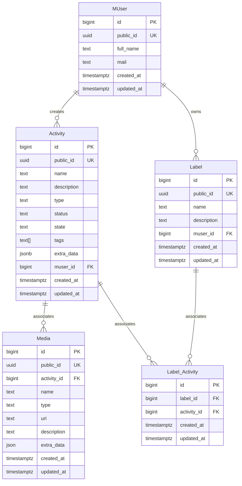

# Architecture

## High level 

## Data Model

# Stack

## Activity Service
* Java 19
* Go (Improver job service)
* Spring Boot
* Spring RestDocs
* Micrometer
* Zipkin
* Loki4j
* Pyroscope
* Slf4j 
* Maven
* GSon
* JJWT

## Identity Management
* Zitadel (SSO)
  * OpenID Connect

## Database
* Postgress

## API Documentation
* Asciidoctor

## Infra
* Jobico Cloud

## Testing
* Junit 5 (Unit)
* TestContainers (Integration) 
* Gatling (Performance)

## Web Client
* React
* W3.CSS
* Babel
* Webpack
* Axios
