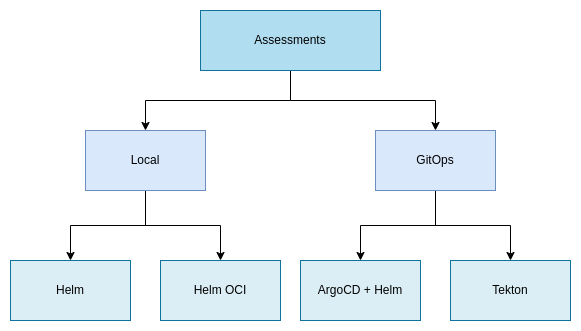
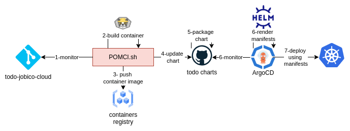
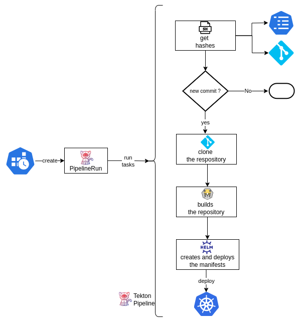

# Introduction

This repository contains the result of my experimentations with GitOps and CI/CD tools. 

# Application

This is simple TODO application implemented using Spring and React, mor einformation its architecture can be found in [this document](ARCH.md).

## Stack
- **Frontend**:  React
- **Backend**: Java 21 and Spring Boot
- **Authentication & Authorization**: Zitadel (provided by Jobico)
- **Database**: PostgreSQL (provided by Jobico)

## Deployment

A detailed step by step instructions to deploy a K8s Jobico cluster and the application can be find here in [this document](LOCAL.md).

# Assesments

This section covers various assessments of use cases, ranging from simple local deployments using Helm to more complex scenarios involving ArgoCD or Tekton.



## Local Deployment

This part outlines two alternatives using a local repository and Helm upgrade/install commands.

### Charts

This script deploys the charts found in the directory: [_infra/helm/todo-charts/charts/](_infra/helm/todo-charts/charts/) . Each time is called, a new version of the application will be deployed.

```bash
$ cd _infra/helm/local
$ ./install.sh
$ helm list
```
### OCI

In this use case, the charts are stored in the Jobico's container registry and referenced during application deployment.

```bash
$ cd _infra/helm/oci/
$ ./pkg.sh # It pushes the charts to the container registry.
$ ./install.sh # It deploys the service and web app using the charts in the registry
$ helm list
```

Once the charts are uploaded to the registry, `install.sh` can be run at any time to deploy a new version of the application with each execution.

## GitOps

### POMCI

This solution employs Helm for manifest templating, ArgoCD for deploying to Kubernetes, GitHub as the charts repository, and POMCI (a custom shell script) for monitoring changes, building container images with Buildah, and pushing them to the registry.

#### Workflow



### Tekton

This solution is implemented as a Tekton pipeline triggered by a Kubernetes cron job. The pipeline compares the last commit hash of the repository with the one for the current deployment; if they differ, it initiates a build and deployment process using Buildah and Helm.

#### Workflow


