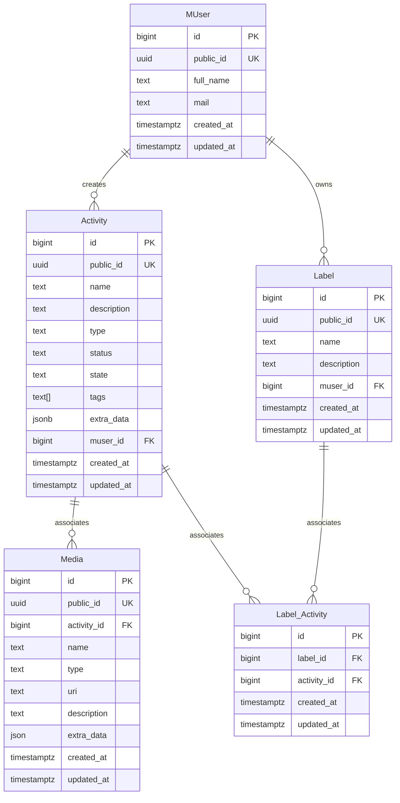

## Introduction

This documentation provides detailed instructions for setting up, configuring, and deploying the TODO web app on the Jobico Cloud platform. 

### Stack

- **Frontend**:  React
- **Backend**: Java 21 and Spring Boot
- **Kubernetes**: Deployment and orchestration
- **Observability**: Grafana stack
- **Authentication & Authorization**: Zitadel
- **Database**: PostgreSQL

### Jobico Cloud Platform

Jobico Cloud is an Kubernetes distribution that includes several components pre-configured for ease of use. It allows developers to quickly deploy and manage applications without extensive setup.

# Getting Started

1. Get Todo-Jobico source code

```bash 
$ git clone https://github.com/andrescosta/todo-jobico-cloud
```

2. Create the Kubernetes cluster

```bash
$ wget https://github.com/andrescosta/jobico-cloud/archive/refs/tags/v2.5.tar.gz
$ tar xzf v2.5.tar.gz 
$ cd jobico-cloud-2.5/
$ ./cluster.sh cfg # This command will generate the cloud-init config files.
...
$ ./cluster new --services # It will create a new K8s cluster with 1 worker node and extras.
```

4. Add Jobico CA locally
```bash
$ cd hacks
$ ./cert_add.sh
```

5. Configure Split DNS

You can follow any online tutorials specific to your Linux distribution for this step. Configure the domain **jobico.org** and the DNS server **192.168.122.23**.

6. Create a **Service User** on Zitadel for the provisioning APIs:

   1. Create the **Service User** using the Zitadel console in https://id.jobico.org/. More info: https://zitadel.com/docs/guides/manage/console/users
   2. Assign the IAM Managers role to the user. More info: https://zitadel.com/docs/guides/manage/console/managers
   3. Create a new KEY here: https://id.jobico.org/ui/console/users/279426608861806877?id=keys and copy the file with the generated KEY to todo-jobico-cloud/_infra/id as **key.json**
  
7. Setup the application

```bash
$ cd todo-jobico-cloud/_infra/bin
$ ./setup.sh # This step create the database and configure the application on Zitadel.
```
8. Configure the Client ID

The output of the previous step is the Cliend ID for our app which must be configured in **todo-web/src/index.js**

9. Deploy the application on Kubernetes

```bash
$ ./deploy.sh # From todo-jobico-cloud/_infra/bin
```
10. Try the App

Open your browser and access to: https://todo.jobico.org

12. Check the Grafana dashboards:

Open your browser and access to: https://grafana.jobico.org/

# Architecture

## High level 


## Data Model



# Stack

## Activity Service
* Java 19
* Go (Improver job service)
* Spring Boot
* Spring RestDocs
* Micrometer
* Zipkin
* Loki4j
* Pyroscope
* Slf4j 
* Maven
* GSon
* JJWT


## Identity Management
* Zitadel (SSO)
  * OpenID Connect

## Database
* Postgress

## API Documentation
* Asciidoctor

## Infra
* Jobico Cloud

## Testing
* Junit 5 (Unit)
* TestContainers (Integration) 
* Gatling (Performance)

## Web Client
* React
* W3.CSS
* Babel
* Webpack
* Axios
